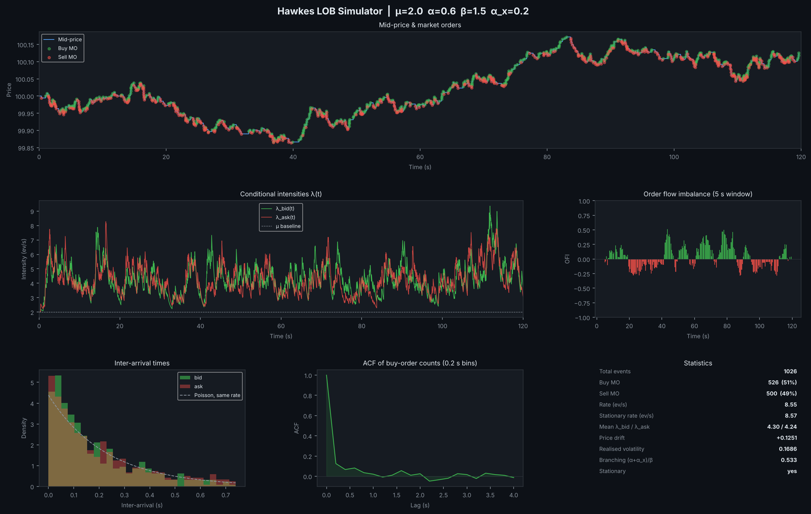

# LOB Modelling — Hawkes-driven limit order book simulator

Simulation of a limit order book (LOB) whose market order flow follows a **bivariate Hawkes process** (buy / sell) with an exponential kernel, with an analysis dashboard, real-time animation and maximum likelihood calibration.



## Model

Intensity of process *i* ∈ {bid, ask}:

$$\lambda_i(t) = \mu + \sum_{j} \sum_{t_k^j < t} \alpha_{ij}\, e^{-\beta (t - t_k^j)}$$

- `μ`: baseline intensity (events/s)
- `α`: self-excitation (a buy order triggers further buy orders)
- `α_x`: cross-excitation (buy → sell and sell → buy)
- `β`: kernel decay rate

The process is stationary when the branching ratio `(α + α_x) / β < 1`.

Simulation uses **Ogata's thinning algorithm (1981)**; calibration relies on **Ozaki's (1979)** recursive log-likelihood, optimised with L-BFGS-B, for both a univariate and the full bivariate model.

## Installation

```bash
pip install -e .            # library + `lob-modelling` command
pip install -e ".[dev]"     # + pytest, coverage, ruff
```

## Usage

```bash
# Static dashboard (mid-price, intensities, OFI, inter-arrival times, ACF, stats)
lob-modelling --mode static --T 120 --seed 42

# Real-time LOB animation (stops after T simulated seconds)
lob-modelling --mode live

# Synthetic data, then univariate and bivariate MLE side by side
lob-modelling --mode calibrate --T 1500 --seed 1
```

`python -m lob_modelling …` works the same way. As a library:

```python
from lob_modelling import HawkesProcess, mle_bivariate

path = HawkesProcess(mu=2.0, alpha=0.6, beta=1.5, alpha_x=0.2, rng=0).simulate(1500)
fit = mle_bivariate(path.times, path.sides, T=1500)
print(fit.mu, fit.alpha, fit.alpha_x, fit.beta, fit.branching_ratio)
```

| Option      | Default | Description              |
|-------------|---------|--------------------------|
| `--mu`      | 2.0     | Baseline intensity       |
| `--alpha`   | 0.6     | Self-excitation          |
| `--beta`    | 1.5     | Decay rate               |
| `--alpha_x` | 0.2     | Cross-excitation         |
| `--T`       | 120     | Simulated horizon (s)    |
| `--tick`    | 0.01    | Tick size                |
| `--depth`   | 5       | Displayed book depth     |
| `--seed`    | none    | Random seed (reproducible runs) |
| `--save`    | `hawkes_lob_results.png` | Static mode: figure path (`""` to skip) |
| `--no-show` | off     | Static mode: don't open a window |

## Code structure

```
src/lob_modelling/
├── hawkes.py        HawkesParams, HawkesProcess (Ogata thinning), exact λ(t) on a grid
├── book.py          LimitOrderBook: mid-price impact, book levels, batch run
├── calibration.py   Univariate and bivariate log-likelihoods and MLE
├── analytics.py     OFI, inter-arrivals, count ACF, realised vol, summary stats
├── plotting.py      Six-panel dashboard
├── live.py          Real-time animation (state kept separate from drawing)
└── cli.py           Command-line entry point
tests/               pytest suite, run in CI on Python 3.10–3.13
```

All randomness goes through a `numpy.random.Generator` passed as `rng=`, so every run is reproducible from a seed.

## Tests

```bash
pytest                 # ~15 s
pytest -m "not slow"   # skip the long calibration-recovery tests
```

Besides unit tests, the suite checks the simulator statistically: the empirical event rate matches the stationary rate `μ / (1 − (α + α_x)/β)`, and the **time-rescaling theorem** holds — compensator increments between events pass a Kolmogorov–Smirnov test against Exp(1). Log-likelihoods are checked against a brute-force O(n²) version with numerical integration.

## Calibration check

Mean (standard deviation) over 20 seeds, `μ=2, α=0.6, β=1.5`, `T=1500` s:

| Parameter | True | Univariate, α_x=0 | Univariate, α_x=0.2 | Bivariate, α_x=0.2 |
|-----------|------|-------------------|---------------------|--------------------|
| μ         | 2.0  | 2.03 (0.10)       | **2.43** (0.12)     | 2.03 (0.10)        |
| α         | 0.6  | 0.59 (0.05)       | 0.62 (0.05)         | 0.59 (0.03)        |
| α_x       | 0.2  | —                 | —                   | 0.19 (0.03)        |
| β         | 1.5  | 1.49 (0.14)       | 1.42 (0.15)         | 1.47 (0.11)        |

Fitting buys alone ignores the excitation coming from sells, which gets absorbed into an inflated baseline μ. The bivariate fit removes that bias.

## Known limitations

- The bivariate model is symmetric (same μ, α, β for both sides); an asymmetric 2×2 kernel would need 7 parameters.
- The book is stylised: fixed 2-tick spread, random queue sizes, uniform price impact between 0.2 and 0.8 tick.

## References

- Ogata, Y. (1981). *On Lewis' simulation method for point processes*. IEEE Trans. Inf. Theory.
- Ozaki, T. (1979). *Maximum likelihood estimation of Hawkes' self-exciting point processes*. Ann. Inst. Stat. Math.
- Bacry, E., Mastromatteo, I., Muzy, J.-F. (2015). *Hawkes processes in finance*. Market Microstructure and Liquidity.

---

<p align="center">
  <a href="https://github.com/matthieu-briche">
    
  </a>
  <br>
  <sub>Matthieu Briche · <a href="https://github.com/matthieu-briche">github.com/matthieu-briche</a></sub>
</p>
